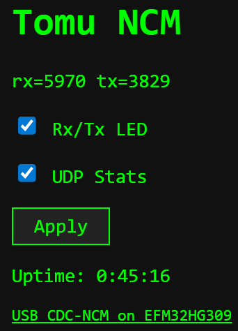
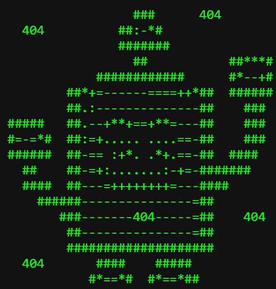

# Tomu USB CDC-NCM (Ethernet NIC) + HTTP web server

This example implements a USB Ethernet adapter, using CDC-NCM, which is natively supported in Windows and Linux.
The program also implements a web server connected to this network, for the host OS to interact with.

## Supported features

 * ARP reply: sends the "server" MAC address matching its requested IP address.
 * ICMP Echo (Ping) reply.
 * A UDP packet with Rx/Tx stats is regularly sent to the host (unless disabled).
 * An HTTP (over TCP/IP port 80) web server serves an HTML page + favicon icon.
 * Unknown GET paths return a 404 page.
 * When a valid packet is received, the red LED is toggled (unless disabled).
 * When a packet is transmitted, the green LED is toggled (unless disabled).

## Usage

* Flash and connect the Tomu to the USB host.
* The host OS CDC-NCM driver will create a new network interface.
* Configure the new interface's IP to the default Host IP.
* Open a browser (or use 'wget', 'ping', etc.) to the default Server IP.

## Default IP addresses and ports

* Server IP: ``192.168.7.1``
* Host IP: ``192.168.7.2``
* HTTP Server TCP port: ``80``
* UDP stats packet port: ``1234``

## Main HTTP page

## 404 HTTP page

